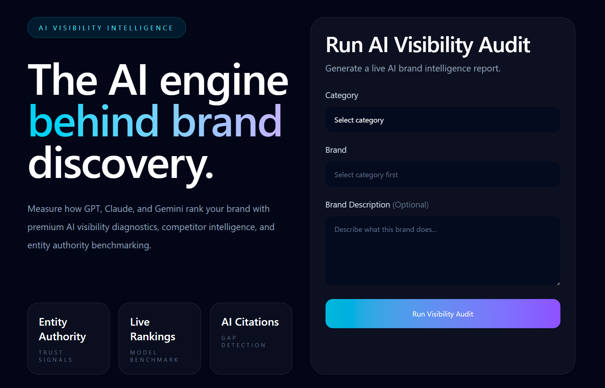

# AI Visibility Intelligence

AI Visibility Intelligence is a premium AI brand audit platform that helps businesses measure how visible and discoverable their brand is across modern AI answer engines like GPT, Claude, and Gemini.

It delivers a structured AI visibility report with brand ranking, competitor benchmarking, model-wise scoring, and strategic recommendations — all through a clean premium dashboard built for modern AI-first businesses.

## Preview



## Live Demo

 https://ai-visibility-intelligence-12cj.vercel.app

---

## Overview

As AI search and answer engines become the new discovery layer for users, traditional SEO is no longer enough.

AI Visibility Intelligence helps brands understand:

* How well AI models recognize and rank their brand
* Where they stand against category competitors
* Which AI models mention them more often
* Where authority and citation gaps exist
* What actions can improve AI discoverability

This platform simulates an AI visibility audit experience for modern brands through a premium, production-ready web interface.

---

## Features

* Premium AI-first audit dashboard
* Category-based brand benchmarking
* AI visibility scoring engine
* Model comparison across GPT, Claude, and Gemini
* Competitor leaderboard analysis
* Strategic AI visibility recommendations
* Optional brand description support
* PDF-ready audit report
* Production-ready frontend and backend architecture

---

## How It Works

### 1. Select a Category

Users begin by selecting a business category such as:

* AI Tools
* SaaS
* Fintech
* Healthcare
* E-Commerce
* Cybersecurity
* Cloud
* Travel
* Productivity
* and more

### 2. Choose a Brand

Once a category is selected, the platform dynamically loads relevant companies from that industry.

Example:

* Category: AI Tools
* Brand: Copy.ai

### 3. Add Brand Description (Optional)

Users can optionally describe what the brand does for better audit context.

Example:

> Copy.ai is an AI writing assistant that helps users generate marketing copy, blogs, emails, and sales content using generative AI.

### 4. Run AI Visibility Audit

The platform generates a structured AI audit report that includes:

* AI Visibility Score
* Category Rank
* Top Competitor
* Main Visibility Weakness
* Model-wise Score Breakdown
* Competitor Ranking Table
* Strategic Recommendations

### 5. Review & Export

Users can review the report in a premium dashboard and export it as a PDF-ready report.

---

## Tech Stack

### Frontend

* Next.js 16
* TypeScript
* Tailwind CSS
* App Router

### Backend

* FastAPI
* Python
* Pydantic

### Deployment

* Vercel (Frontend)
* Render (Backend)

---

## Project Structure

```bash
AI-Visibility-Intelligence/
│
├── backend/
│   ├── data/
│   │   └── company_master.py
│   ├── services/
│   │   └── company_lookup.py
│   ├── engine.py
│   ├── main.py
│   └── requirements.txt
│
├── frontend/
│   ├── app/
│   │   ├── results/
│   │   │   └── page.tsx
│   │   ├── globals.css
│   │   ├── layout.tsx
│   │   └── page.tsx
│   ├── public/
│   ├── package.json
│   └── vercel.json
│
└── README.md
```

---

## API Endpoints

### Health Check

```http
GET /
```

### Fetch Categories

```http
GET /categories
```

### Fetch Brands by Category

```http
GET /companies/{category}
```

### Run Audit

```http
POST /audit
```

#### Request Body

```json
{
  "brand": "Copy.ai",
  "category": "AI Tools",
  "description": "AI writing assistant for content generation"
}
```

---

## Example Audit Output

* **Brand:** Copy.ai
* **Category:** AI Tools
* **AI Visibility Score:** 80
* **Rank Position:** 7
* **Top Competitor:** OpenAI
* **Main Weakness:** Copy.ai shows weaker AI citation depth than OpenAI

The report also includes:

* GPT-4 score
* Claude score
* Gemini score
* competitor leaderboard
* strategic recommendations

---

## Use Cases

* AI-first SEO benchmarking
* Brand discoverability audits
* Competitor intelligence
* AI search visibility analysis
* Marketing strategy diagnostics
* Product positioning reviews

---

## Local Setup

### Clone the Repository

```bash
git clone https://github.com/hiteshgowda017/AI-Visibility-Intelligence.git
cd AI-Visibility-Intelligence
```

### Backend Setup

```bash
cd backend
pip install -r requirements.txt
uvicorn main:app --reload
```

### Frontend Setup

```bash
cd frontend
npm install
npm run dev
```

---

## Environment Variables

### Frontend

```env
NEXT_PUBLIC_API_URL=http://127.0.0.1:8000
```

### Backend

```env
FRONTEND_ORIGIN=http://localhost:3000
```

---

## Future Improvements

* Real LLM API integrations
* Live citation tracking
* SERP + AI snapshot ingestion
* AI mention monitoring
* historical brand visibility trends
* multi-brand comparison reports
* exportable client dashboards

---

## Author

**Hitesh Gowda H**
Built as a modern AI visibility intelligence platform for AI-first brand discovery and competitive benchmarking.

* GitHub: [https://github.com/hiteshgowda017](https://github.com/hiteshgowda017)

